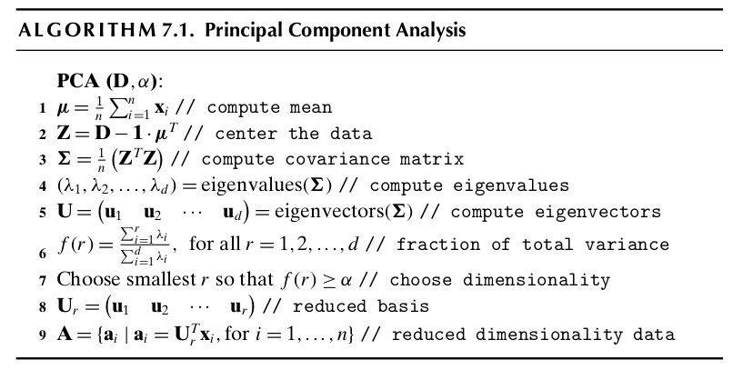
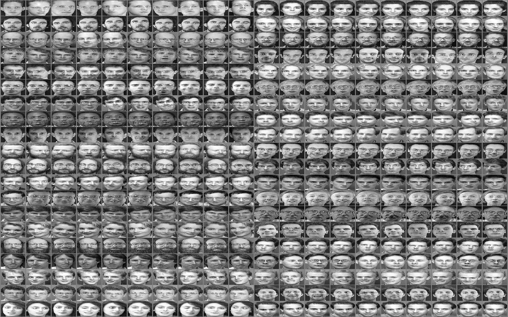
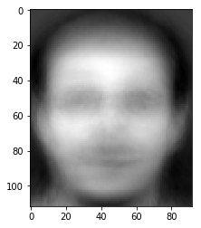
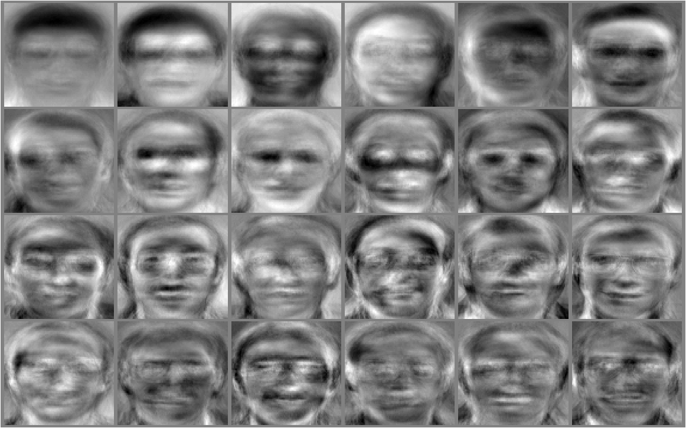
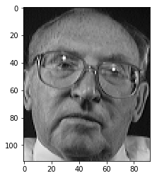
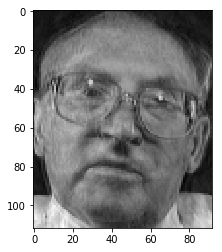
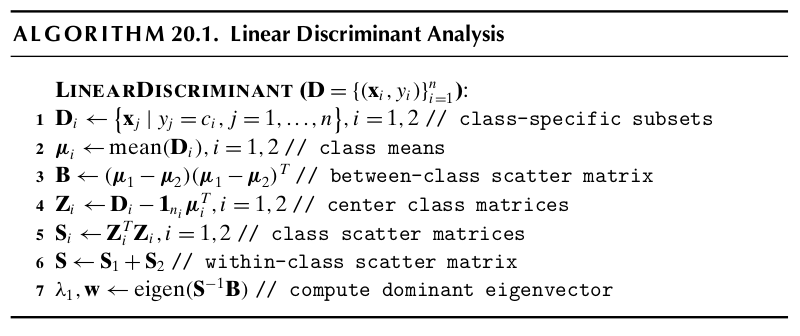

# FaceRecognition
◦Implemented PCA and LDA dimensionality reduction techniques for facial recognition, and performed classification on faces and non-faces

### Authors: Anas Emad & Mohab Ayman & Mazen Ahmed at March 2023
## Introduction

Face recognition has become a major field of interest these days. Face recognition algorithms are used in a wide range of applications such as security control,crime investigation, and entrance control in buildings, access control at automatic teller machines, passport verification, identifying the faces in a given databases. Formally, Face recognition is the bio-metric identification by scanning a person’s face and matching it against a library of known faces.
In this assignment, we implement two different image recognition approaches.
The first is Eigenfaces which is one of the most widely used representations, which are based on principal component analysis and use a nearest neighbour classifier. The second is Fisherfaces which use linear/Fisher discriminant analysis (FLD/LDA) for best discriminating the face images of same class and also use a nearest neighbour classifier.

## Approach one: Classification using Eigenfaces and Principal component analysis

PCA is also known as Karhunen Loeve projection.Principal component analy-
sis (PCA) is a statistical procedure that uses an orthogonal transformation to
convert a set of observations of possibly correlated variables (entities each of
which takes on various numerical values) into a set of values of linearly uncor-
related variables called principal components and refrred to as Eigenfaces. In
PCA, the main idea to re-express the available dataset to extract the relevant
information by reducing the redundancy and minimize the noise. A nearest
neighbour classifier works afterwards by comparing compare a face’s position in
Eigenfaces subspace with the position of known individuals and the distances
between them.

### Algorithm

PCA algorithm steps and procedure is provided in Figure 1 which is taken from [1] from Chapter 7.

PCA is mathematically defined as an orthogonal linear transformation that
transforms the data to a new coordinate system such that the greatest variance
by some projection of the data comes to lie on the first coordinate (called the first
principal component), the second greatest variance on the second coordinate,
and so on. PCA calculates the Eigenvectors of the co-variance matrix, and
projects the original data onto a lower dimensional feature subspace, which is
defined by Eigenvectors with large Eigenvalues. The coordinates of the data
points in the lower subspace dimension is computed and fed to the classifier
after this algorithm job ends.

### Implementation and Results.

We implemented the above algorithm in Figure 1 using Python and Numpy
arrays. The results shown in this section are related to the 50-50 data split
test, results on the 70-30 data split test can be obtained from the source code
attached and referred to later on. Computing the mean vectors of each dimen-
sion, normalizing the data, and computing the co-variance matrix, Eigenvalues
and Eigenvectors. After Projection of data, we obtain the coordinates A matrix
and use finally the simple (i.e k = 1) k-nearest neighbour classifier to determine
the class labels of testing data. We established four trials when choosing the di-
mensionrbased on four different values ofα: 0.8 , 0.85, 0.9, 0.95 which yielded
different values ofrand recomputed the accuracy of the classifier for each trial.
Figures 2 and 3 show a plot of the relation betweenrandαand betweenαand
accuracy of the KNN classifier respectively. From figure 2, it can be deduced

that as alpha increases, the number of reduced dimensions required to achieve
that alpha value increases. It is then obvious from figure 3, that after a certain
alpha value there is no clear or big change in accuracy and it actually decreases
when alpha is set to 0.95 as it is over-fits. So, we can deduce the best alpha
value here is 0.8, which achieves very good accuracy with no or little redundant
dimensions in the subspace.

### Visualization of EigenFaces

The aim of this section is to better grasp the concept of Eigenfaces in action
rather than in mathematical formulas and codes.
First,the dataset we worked on in this assignment is the ATT face database
(formerly the ORL database)[2]. It is heavily used in publications as an example
of an easy set of images as the pictures are taken under very similar conditions.
There are ten different images of each of 40 distinct classes(i.e persons). For
some subjects, the images were taken at different times, varying the lighting,
facial expressions (open / closed eyes, smiling / not smiling) and facial details
(glasses / no glasses). All the images were taken against a dark homogeneous

background with the subjects in an upright, frontal position (with tolerance
for some side movement). A preview image of the Database of Faces is shown
in Figure 4. Second, we split the photos into training and test sets using two
different splits in two different files ( 50-50 splits and 70-30 splits). The mean
face is the face that resembles roughly most of the dataset faces features, the
mean face of the train set, in case of 50-50 is shown in Figure 5.

Then, we completed the procedure as explained in 2.2 and the Eigenfaces

produced as those shown in Figure 6.
Finally, to complete the purpose of this section, we show the reconstruction of
a sample face via the Eigenfaces obtained. Figure 7(a) shows the original face
while 7(b) shows the reconstructed one.

So, to summarize our work in the first approach, Eigenfaces along with a
simple KNN Classifier did a very good job in faces classification as well as face
reconstruction experiment conducted on a sample test face.

## Approach two: classification using Linear Discriminant Analysis

Linear discriminant analysis (LDA), also called normal discriminant analysis
(NDA), or discriminant function analysis is a generalization of Fisher’s linear
discriminant, a method used in statistics, pattern recognition and machine learn-
ing to find a linear combination of features that characterizes or separates two
or more classes of objects or events.
Ronald A. Fisher formulated the Linear Discriminant in 1936 in [3], and it also
has some practical uses as classifier. The original Linear discriminant was de-
scribed for a 2-class problem, and it was then later generalized as “multi-class
Linear Discriminant Analysis” in [4].
The goal of LDA is to project a feature space (a dataset n-dimensional samples)
onto a smaller subspace k (where k is smaller than or equal to n-1) while main-
taining the class-discriminatory information. In other words, it seeks to reduce
dimensionality while class separation in mind.

### Algorithm

LDA algorithm steps and procedure is provided in Figure 8 which is taken from
[1] from Chapter 20.

As the algorithm lists, the steps involved in the algorithm is as follows. Step
one, compute d-dimensional mean vectors for different classes from the dataset,
where d is the dimension of feature space.Step two, compute in-between class
and with-in class scatter matrices.Step three, compute Eigenvectors and corre-
sponding Eigenvalues for the scatter matrices. Step four, choose k Eigenvectors
corresponding to top k Eigenvalues to form a transformation matrix of dimension
dxk. Step five, transform the d-dimensional feature space X to k-dimensional
feature subspace Y via the transformation matrix.

## Implementation and results

Again, we implemented the above algorithm in Figure 8 using Python and
Numpy arrays. In order to find a good projection vector, we need to define a
measure of separation between the projections. However, the distance between
the projected means is not a very good measure since it does not take into
account the standard deviation within the classes. The solution proposed by
Fisher is to maximize a function that represents the difference between the
means, normalized by a measure of the within-class variability, or the so-called
scatter.The Fisher linear discriminant is defined as the linear functionwTxthat
maximizes the criterion function: (the distance between the projected means
normalized by the within-class scatter of the projected samples. Therefore, we
will be looking for a projection where examples from the same class are projected
very close to each other and, at the same time, the projected means are as farther
apart as possible. Thus, It can be shown that the optimal projection matrix
W∗is the one whose columns are the eigenvectors corresponding to the largest
eigenvalues of generalized eigenvalue problem.
The main resulting matrices of the implementation is shown in figures below,
more can be found in the source code though.

Finally, we note the KNN classifier scores using LDA on (50-50) and (70-30)
splits were 0.55 and 0.64 respectively.

### Limitations of LDA

Although, LDA sounds fancy and a good option it is wise to consider it’s prob-
lems and whether it is going to be a good choice for you when applying it on
your data or not. Firstly, LDA produces at most C-1 feature projections. If
the classification error estimates establish that more features are needed, some
other method must be employed to provide those additional features.
Secondly,LDA is a parametric method since it assumes uni-modal Gaussian like-
lihoods. If the distributions are significantly non-Gaussian, the LDA projections
will not be able to preserve any complex structure of the data, which may be
needed for classification.
Lastly, LDA will fail when the discriminatory information is not in the mean
but rather in the variance of the data.

In any of these cases do occur, you can consider other variants of LDA that
solve some of those limitations mentioned above such as Non-parametric LDA,
Orthonormal LDA , Generalized LDA and Multilayer perceptrons. Moreover,
you can be directed otherwise to use a totally different dimension reduction
technique such as PCA, Exploratory Projection Pursuit or Sammon’s non-linear
mapping.

## Conclusion

In general, dimensionality reduction does not only help reducing computational
costs for a given classification task, but it can also be helpful to avoid over-fitting
by minimizing the error in parameter estimation (“curse of dimensionality”). In
this work, we worked in the aim to implement a face recognition software based

on KNN Classification and using dimensionality reduction before applying it to
the classifier with two approaches, one was LDA and the other was PCA.

### PCA vs LDA

LDA is also closely related to principal component analysis (PCA) and in that
they both look for linear combinations of variables which best explain the
data.LDA explicitly attempts to model the difference between the classes of
data. PCA on the other hand does not take into account any difference in class,
and factor analysis builds the feature combinations based on differences rather
than similarities.

Both Linear Discriminant Analysis (LDA) and Principal Component Anal-
ysis (PCA) are linear transformation techniques that are commonly used for di-
mensionality reduction. PCA can be described as an “unsupervised” algorithm,
since it “ignores” class labels and its goal is to find the directions (the so-called
principal components) that maximize the variance in a dataset. In contrast to
PCA, LDA is “supervised” and computes the directions (“linear discriminant”)
that will represent the axes that that maximize the separation between multiple
classes. Although it might sound intuitive that LDA is superior to PCA for a
multi-class classification task where the class labels are known, this might not
always the case. For example, comparisons between classification accuracies for
image recognition after using PCA or LDA show that PCA tends to outperform
LDA if the number of samples per class is relatively small as shown in [5]. In
practice, it is also common to use both LDA and PCA in combination: E.g.,
PCA for dimensionality reduction followed by an LDA, this approach is called
the Fisher Faces and was proposed in [6]. As we mention later on, one of our

future improvement tasks is to implement this approach and compare it with
our work here. Also in case of uniformly distributed data, LDA almost always
performs better than PCA. However if the data is highly skewed (irregularly
distributed) then it is advised to use PCA since LDA can be biased towards the
majority class.

### Future Improvements and Goals

In this section we would like to point out some final notes that we would like
to do futuristic improvements in our source code and implementation. One of
those being is implementing the Fisher Faces approach (Applying PCA first
then feeding it as input to the LDA) and comparing it with the two approaches
already implemented in order to get a full view of the idea. Also, we would
like to apply some OOP and modularity in our code by breaking down the
source code into various python files in which there is a Utility class for the
helper methods and also a main class for the ML algorithms applied. Also,
it is important to point out that the accuracy scores achieved by LDA was
unsatisfactory like those obtained from PCA so maybe a last goal is to ensure
that our implementations are correct and that this is just the nature’s work.

## References

[1]Data Mining and Analysis: Fundamental Concepts and Algorithms MO-
HAMMED J. ZAKI Rensselaer Polytechnic Institute, Troy, New York WAG-
NER MEIRA JR. Universidade Federal de Minas Gerais, Brazil

[2]ATT Face database, or formally ORL Faces

[3]”The Use of Multiple Measurements in Taxonomic Problems” by Ronald A.
Fisher in 1936

[4]”Multiple Discriminant Analysis” by C. R. Rao in 1948

[5]PCA vs. LDA, A.M. Martinez et al., 2001

[6]”Eigenfaces vs. Fisherfaces: Recognition Using Class Specific Linear Pro-
jection” by Peter N. Belhumeur, Joao P. Hespanha, and David J. Kriegman

[7]FACE RECOGNITION USING PCA, LDA AND VARIOUS DISTANCE
CLASSIFIERS

